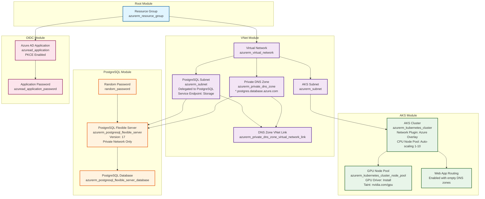

# terraform-azure-adaptive-engine

Terraform modules used to deploy all of the infrastructure for adaptive on azure

## Example usage


```terraform
module "azure-engine" {
  source  = "app.terraform.io/AdaptiveML/azure-engine/adaptive"
  version = "<todo>"

  deployment_name = "adaptive"

  hostname = "https://adaptive.aks.example.com"

  cidr_vnet = "10.0.0.0/14"

  cpu_node_pool_vm_size = "Standard_D16as_v6"
  gpu_node_pool_vm_size = "Standard_ND96isr_H200_v5"
  gpu_node_count        = 1

  db_sku_name = "GP_Standard_D2s_v3"
  location    = "west us 3"
}

output "out" {
  sensitive = true
  value     = module.azure-engine
}
```

## Deployment process

1. Apply the Terraform module. This will install all of the prerequisite for Azure infrastructure
2. Store the needed output (db connection string, oidc config) from the terraform run
```bash
# Disploy OIDC config - used in secrets.auth.oidc.providers in the helm chart
$ terraform output -json out | jq -r .oidc_auth_config
# Disploy DB url - used in secrets.dbUrl
$ terraform output -json out | jq -r .postgres_connection_string
```
3. Get access to the newly create aks cluster
```bash
$ export RG=$(terraform output -json out | jq .resource_group_name )
$ export CLUSTER=$(terraform output out | jq .aks_cluster_name)
$ az aks get-credentials -g ${RG} -n ${CLUSTER} --overwrite-existing
```
4. Install nvidia-gpu-operator
```bash
$ helm repo add nvidia https://helm.ngc.nvidia.com/nvidia
$ helm repo update
$ helm install --wait --generate-name -n gpu-operator --create-namespace nvidia/gpu-operator --version=v25.10.0
```
5. Install Helm chart by following the `Azure` documention in https://github.com/adaptive-ml/adaptive-helm-chart

## Architecture Schema of what is being installed



### Key Resource Details

- **Networking**: VNet with automatic CIDR subnet carving for PostgreSQL (/8 extension) and AKS (/2 extension). PostgreSQL subnet includes Storage service endpoint and delegation to Microsoft.DBforPostgreSQL/flexibleServers
- **Kubernetes**: AKS cluster with Azure CNI Overlay networking, auto-scaling CPU nodes (1-10), and dedicated GPU node pool with automatic driver installation and nvidia.com/gpu taint
- **Database**: PostgreSQL Flexible Server (version 17) with private network access only, linked to private DNS zone with VNet integration
- **Authentication**: Azure AD application with OIDC/PKCE configuration for secure authentication, including issuer URL, client credentials, and configurable scopes
- **DNS**: Private DNS zone for PostgreSQL internal resolution (no public DNS zone managed by this module)

<!-- BEGIN_TF_DOCS -->
## Requirements

| Name | Version |
|------|---------|
| <a name="requirement_terraform"></a> [terraform](#requirement\_terraform) | >= 1.10.0 |
| <a name="requirement_azurerm"></a> [azurerm](#requirement\_azurerm) | ~> 4.0 |
| <a name="requirement_random"></a> [random](#requirement\_random) | ~> 3.0 |

## Providers

| Name | Version |
|------|---------|
| <a name="provider_azurerm"></a> [azurerm](#provider\_azurerm) | 4.52.0 |

## Modules

| Name | Source | Version |
|------|--------|---------|
| <a name="module_aks"></a> [aks](#module\_aks) | ./aks | n/a |
| <a name="module_dns"></a> [dns](#module\_dns) | ./dns_zone | n/a |
| <a name="module_oidc"></a> [oidc](#module\_oidc) | ./oidc_app | n/a |
| <a name="module_postgres"></a> [postgres](#module\_postgres) | ./postgres | n/a |
| <a name="module_vnet"></a> [vnet](#module\_vnet) | ./vnet | n/a |

## Resources

| Name | Type |
|------|------|
| [azurerm_resource_group.this](https://registry.terraform.io/providers/hashicorp/azurerm/latest/docs/resources/resource_group) | resource |

## Inputs

| Name | Description | Type | Default | Required |
|------|-------------|------|---------|:--------:|
| <a name="input_cidr_vnet"></a> [cidr\_vnet](#input\_cidr\_vnet) | CIDR to use for the VNET | `string` | n/a | yes |
| <a name="input_cpu_node_pool_vm_size"></a> [cpu\_node\_pool\_vm\_size](#input\_cpu\_node\_pool\_vm\_size) | VM size to use for CPU node pool | `string` | `"Standard_D16as_v6"` | no |
| <a name="input_db_sku_name"></a> [db\_sku\_name](#input\_db\_sku\_name) | The vm class for the Postgres DB. | `string` | `"GP_Standard_D4ads_v5"` | no |
| <a name="input_deployment_name"></a> [deployment\_name](#input\_deployment\_name) | Name of the deployment | `string` | `"adaptive"` | no |
| <a name="input_gpu_node_count"></a> [gpu\_node\_count](#input\_gpu\_node\_count) | Number of GPU nodes inside the node pool | `number` | n/a | yes |
| <a name="input_gpu_node_pool_vm_size"></a> [gpu\_node\_pool\_vm\_size](#input\_gpu\_node\_pool\_vm\_size) | VM size to use for GPU node pool | `string` | n/a | yes |
| <a name="input_hostname"></a> [hostname](#input\_hostname) | Hostname of the deployment in the format 'https://<url>' | `string` | n/a | yes |
| <a name="input_location"></a> [location](#input\_location) | Region of the deployment | `string` | n/a | yes |
| <a name="input_postgres_version"></a> [postgres\_version](#input\_postgres\_version) | The version of PostgreSQL to use. | `string` | `"17"` | no |
| <a name="input_tags"></a> [tags](#input\_tags) | Tags to apply to created resources | `map(string)` | `{}` | no |

## Outputs

| Name | Description |
|------|-------------|
| <a name="output_aks_kube_config"></a> [aks\_kube\_config](#output\_aks\_kube\_config) | Kubernetes config for the AKS cluster |
| <a name="output_helm_values"></a> [helm\_values](#output\_helm\_values) | TODO |
| <a name="output_oidc_auth_config"></a> [oidc\_auth\_config](#output\_oidc\_auth\_config) | OIDC authentication configuration for Azure AD |
| <a name="output_postgres_connection_string"></a> [postgres\_connection\_string](#output\_postgres\_connection\_string) | PostgreSQL connection string for the adaptive database |
| <a name="output_postgres_database_name"></a> [postgres\_database\_name](#output\_postgres\_database\_name) | The name of the PostgreSQL database |
| <a name="output_postgres_server_fqdn"></a> [postgres\_server\_fqdn](#output\_postgres\_server\_fqdn) | The fully qualified domain name of the PostgreSQL server |
<!-- END_TF_DOCS -->
